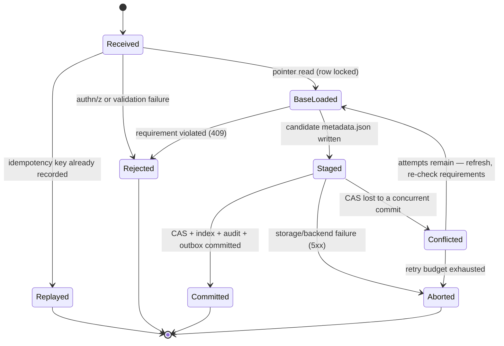

# Commit protocol

| | |
|---|---|
| **Status** | Accepted. Implemented (M1): `crates/meridian-store/src/commit.rs` (Postgres backend), `crates/meridian-server/src/routes/tables.rs` (endpoints + driver). |
| **Scope** | The table-commit path: single-table commits, multi-table transactions, their invariants, failure handling, and the executable property suite that guards them. |
| **Related** | [ADR 001](../adr/001-m0-foundation.md) (outbox, audit chain, ULID ids) · `crates/meridian-iceberg/src/commit.rs` (protocol contract) · `crates/meridian-iceberg/tests/commit_harness/` (executable properties, run against the model **and** the Postgres backend) · [Iceberg REST catalog spec](https://iceberg.apache.org/rest-catalog-spec/) |

The commit path is the correctness-critical core of the catalog: it is the one
place where losing a race means losing someone's data. The project rule is
that **no feature code touches this path without (a) this design document and
(b) a passing property-test suite**. This document is the design; the
properties in `commit_properties.rs` are its executable form.

## 1. The model in one paragraph

An Iceberg REST commit is optimistic: the client sends a list of
**requirements** (assertions about the table state it based its work on) and a
list of **updates** (the changes to apply). The catalog is the arbiter. It
evaluates the requirements against the *current* metadata; if they hold, it
materializes a new `metadata.json` in object storage and atomically swaps the
table's **pointer** — the record of which metadata file is current — to the
new file. Meridian keeps that pointer in PostgreSQL as a
(`metadata_location`, `pointer_version`) pair on the table row, and performs
the swap as a version-guarded compare-and-set (CAS) inside a Postgres
transaction that also carries the metadata index write-through, the audit row,
and the outbox event. Object storage remains the source of truth engines see;
Postgres is the arbiter of *which* file is current.

## 2. Definitions

| Term | Meaning |
|---|---|
| **Pointer** | The `(metadata_location, pointer_version)` pair on a table row in Postgres. `metadata_location` is the object-storage path of the current `metadata.json`. |
| **Pointer version** | A `bigint` that increases by exactly 1 per successful commit. Internal to Meridian (it is not an Iceberg concept); exists so the swap can be expressed as a CAS and so history is provably gapless. |
| **Staged file** | A candidate `metadata.json` written to object storage under a unique name before the pointer swap. Unreferenced until the swap commits. |
| **CAS** | `UPDATE tables SET pointer_version = v+1, metadata_location = $new WHERE id = $t AND pointer_version = v`. Succeeds iff nobody else committed since `v` was observed. |
| **Index write-through** | Rows derived from the new metadata (snapshots, schemas, partition summaries, stats) inserted in the same transaction as the swap, per the metadata-forward design. |
| **Outbox event** | The event row describing the commit, inserted in the same transaction (see ADR 001 §6). Published asynchronously by the relay. |
| **Idempotency key** | A client-supplied opaque key; the recorded outcome of a commit is replayed for retries carrying the same key. |
| **Commit attempt** | One pass through the state machine in §6. A single client request may internally contain several attempts (CAS retries). |

## 3. Single-table commit sequence

The numbered steps below are normative. Steps 5–11 execute inside one
Postgres transaction; step 7 (the storage write) is the only side effect
outside it.

1. **Authenticate and authorize.** Before any I/O beyond principal
   resolution. Denials are themselves audited.
2. **Idempotency recall.** If the request carries an idempotency key that has
   a recorded receipt, return that receipt (marked as a replay). No state is
   touched. See §8.
3. **Validate the request shape.** Structural validation of requirements and
   updates (parseable, non-empty, no duplicate table). Failures are 4xx and
   reach no further.
4. **Begin transaction.**
5. **Lock and load the pointer.** `SELECT … FROM tables WHERE id = $t FOR
   UPDATE`. The row lock serializes writers of the same table for the rest of
   the transaction.
6. **Evaluate requirements** against the current metadata. Evaluation is
   served from the Postgres index where possible, falling back to reading the
   current `metadata.json`. A violated requirement rolls back and returns
   `409 CommitFailedException` — the client must refresh and rebuild its
   commit. (Pre-commit hooks — synchronous, cheap predicates such as contract
   checks — run here too. This is now live: the data-contract circuit breaker
   evaluates enabled contracts against the staged metadata at this point and
   can block, quarantine, or warn. See
   [`contracts-circuit-breaker.md`](contracts-circuit-breaker.md).)
7. **Apply updates and stage the result.** Apply the update list to the
   loaded metadata, producing candidate metadata; validate structural
   invariants (ids resolve, refs point at snapshots that exist, monotonic
   `last-updated-ms`, etc.); write it to object storage as
   `metadata/<v+1>-<uuid>.metadata.json` (a random UUID — the file-name
   convention engines write; unique per attempt). Object PUTs are atomic,
   so a failed PUT leaves nothing partial. A PUT failure aborts the
   transaction (rollback; nothing durable happened).
8. **CAS the pointer.** The guarded `UPDATE` from §2. The guard is retained
   even though the row lock makes a lost race impossible within a healthy
   server — correctness must not depend on lock discipline alone (defense in
   depth, and the property model in §9 exercises exactly this guard).
9. **Index write-through.** Insert the derived index rows.
10. **Audit + outbox + idempotency receipt.** Insert the hash-chained audit
    row, the outbox event, and the idempotency receipt (if a key was given) —
    all in this same transaction.
11. **Commit the transaction.** This is the point of no return: the commit
    *happened* if and only if this succeeds.
12. **Respond**, then post-commit work proceeds asynchronously off the outbox
    (event fan-out, enrichment, maintenance triggers). Nothing
    response-blocking happens after step 11.

```mermaid
sequenceDiagram
    autonumber
    participant C as Client (engine / SDK)
    participant API as meridian-server
    participant ENG as Commit engine
    participant PG as PostgreSQL
    participant OS as Object storage

    C->>API: commit(requirements, updates, idempotency key?)
    API->>API: authenticate + authorize
    API->>ENG: execute commit
    ENG->>PG: recall idempotency key
    alt key already recorded
        PG-->>ENG: recorded receipt
        ENG-->>C: replayed response (no state change)
    else fresh commit
        ENG->>PG: BEGIN
        ENG->>PG: SELECT ... FROM tables WHERE id = $t FOR UPDATE
        PG-->>ENG: pointer (version V, location L)
        ENG->>ENG: evaluate requirements vs current metadata
        alt requirement violated
            ENG->>PG: ROLLBACK
            ENG-->>C: 409 CommitFailedException
        else requirements hold
            ENG->>ENG: apply updates, validate candidate metadata
            ENG->>OS: PUT metadata/(V+1)-(uuid).metadata.json
            OS-->>ENG: durable
            ENG->>PG: UPDATE tables SET pointer_version = V+1,<br/>metadata_location = $new<br/>WHERE id = $t AND pointer_version = V
            ENG->>PG: INSERT index rows (snapshots, schemas, stats)
            ENG->>PG: INSERT audit row (hash chain)
            ENG->>PG: INSERT outbox event
            ENG->>PG: INSERT idempotency receipt
            ENG->>PG: COMMIT
            ENG-->>C: 200, new metadata (version V+1)
        end
    end
    Note over PG,OS: async: outbox relay publishes events;<br/>orphaned staged files are swept (see §7)
```

### Locking versus CAS

The row lock (step 5) and the CAS guard (step 8) are deliberately redundant:

- The **lock** makes requirement evaluation and the swap race-free within one
  server and bounds wasted work (a doomed committer waits instead of writing
  a metadata file it will fail to publish).
- The **CAS guard** is the actual correctness mechanism. It holds even if
  lock discipline is broken by a bug, a manual operation, or a future
  implementation that opts into optimistic staging (stage the file *before*
  taking the lock to shorten lock hold time — an allowed optimization
  precisely because the guard, not the lock, carries the invariant).

The property model (§9) is built on the CAS alone, with adversarial
interleavings between load and swap — i.e. it verifies the protocol under
*weaker* assumptions than the implementation actually runs with.

**Implementation note (M1).** The shipped implementation uses the
optimistic-staging variant: the candidate file is staged *before* the
transaction takes the row lock, and the lock is held only across the CAS and
its bookkeeping (single-digit milliseconds, no storage I/O under the lock).
The CAS guard carries invariant I1 exactly as designed; a guard failure
re-enters `BaseLoaded` (requirements re-checked against the new state, a
fresh file staged) and the loser's staged file is cleaned per §7.1. This is
the trade sanctioned above: `Conflicted` is a reachable state, in exchange
for never holding a row lock across a PUT.

## 4. Multi-table transactions

The transactions endpoint commits N tables atomically. The sequence is the
same as §3 with these changes:

1. **Deterministic lock order.** Table rows are locked in ascending table-ULID
   order, in a single statement:
   `SELECT … FROM tables WHERE id = ANY($ids) ORDER BY id FOR UPDATE`.
   The `ORDER BY` is mandatory — Postgres acquires row locks in the order rows
   are produced, and an unordered plan can lock in any order. Two transactions
   that both lock in the same global total order cannot deadlock (a deadlock
   requires a cycle; a total order admits none).
2. **All requirements first.** Requirements for every table are evaluated
   before any update is applied. Any violation rolls back the whole
   transaction; the response names every violated requirement, not just the
   first.
3. **Stage all files.** One staged `metadata.json` per table (PUTs may run in
   parallel — they are independent objects).
4. **CAS every pointer in the one transaction**, each with its own version
   guard, plus per-table index write-through, per-table audit rows and outbox
   events sharing a single `commit_id` ULID so the transaction is
   reconstructable from the audit log.
5. **Commit.** All pointers move, or none do. There is no partial-commit
   state at any point, including during crashes (Postgres atomicity).

A duplicate table in the request set is rejected up front (two operations on
one table in one transaction have no defined merge order).

## 5. Invariants

These are the guarantees the implementation must uphold and the property
suite asserts. Violating any of them is a release-blocking bug.

- **I1 — No lost updates.** Every successful commit's requirements and
  version guard were evaluated against exactly the state its swap replaced.
  Equivalently: pointer versions form a gapless sequence, and the number of
  successful commits equals the version delta.
- **I2 — No partial multi-table commits.** For any multi-table transaction,
  either every table's pointer moved or none did — observable at every
  instant, including mid-crash.
- **I3 — Monotonic history.** `pointer_version` increases by exactly 1 per
  commit and never regresses. The metadata log and snapshot log are
  append-only; a commit never rewrites published history.
- **I4 — Crash safety.** A state change is visible if and only if its audit
  row and outbox event exist (same transaction). The pointer never references
  a metadata file that is not durably written (the PUT strictly precedes the
  swap). A crash at any step yields either "nothing happened" or "everything
  happened, event pending relay" — never a third state.
- **I5 — Idempotency.** A retry carrying the same idempotency key returns the
  recorded receipt and applies nothing. A commit is applied at most once per
  key.
- **I6 — Full audit coverage.** There is no code path that mutates a pointer
  without writing the audit row in the same transaction. This includes
  internal jobs and repair tooling.

## 6. Commit-attempt state model



| State | Meaning | Durable side effects so far |
|---|---|---|
| `Received` | Request parsed, principal resolved. | none |
| `Replayed` | Terminal. Recorded receipt returned. | none (from this attempt) |
| `Rejected` | Terminal, 4xx. Auth, validation, or requirement failure. | audit row for the denial |
| `BaseLoaded` | Pointer read under lock; requirements evaluated. | none |
| `Staged` | Candidate `metadata.json` durably written. | one unreferenced staged file |
| `Conflicted` | Version guard failed at swap time. | staged file now orphaned |
| `Committed` | Terminal. Transaction committed. | pointer, index, audit, outbox, receipt |
| `Aborted` | Terminal, 5xx. Transaction rolled back. | possibly an orphaned staged file |

`Conflicted` is unreachable while the row lock is held (see §3) but is a real
state of the protocol — it exists in the model, in any optimistic-staging
implementation, and as the defense-in-depth path if locking is ever wrong.
On re-entry to `BaseLoaded`, requirements are re-evaluated against the *new*
state and updates are re-applied on the refreshed base; a fresh file is
staged. Retries are bounded; exhaustion returns `409 CommitFailedException`.

## 7. Failure matrix

| # | Failure | Durable state afterwards | Client sees | Recovery |
|---|---|---|---|---|
| F1 | Storage PUT fails (step 7) | Nothing (rollback; object PUTs are atomic, no partial file) | 5xx, retryable | Client retries; idempotency key optional (nothing was applied) |
| F2 | PUT succeeds, Postgres transaction fails or aborts | Orphaned staged file; no pointer/index/audit change | 5xx, retryable | Retry. Orphan removed by best-effort immediate delete, else the sweep (§7.1) |
| F3 | Crash between PUT and transaction commit | Same as F2 | Connection error | Same as F2 (I4: the swap and its bookkeeping are atomic) |
| F4 | Transaction commits, process crashes before responding | Commit fully applied; event awaiting relay | Connection error | Client retries with its idempotency key → receipt replayed (I5). Without a key, the retry fails on requirements (409) — visible, not silent double-apply |
| F5 | Transaction commits, event publish fails | Commit applied; outbox row unpublished | 200 (publish is async) | Outbox relay retries until published; at-least-once delivery, consumers deduplicate on event ULID |
| F6 | Concurrent committer wins the race | Winner committed; loser's guard fails | Loser: internal rebase-retry, else 409 | Requirements re-checked against new state; bounded retries (§6) |
| F7 | Requirement violated (stale client) | Nothing | 409 `CommitFailedException` | Client refreshes metadata and rebuilds the commit |
| F8 | Postgres unavailable | Nothing (possibly an orphaned staged file if it failed mid-flight) | 503 | Retry when healthy; sweep handles any orphan |
| F9 | Idempotency key reused with a different request | Nothing | 4xx (key-reuse error) | Client bug; surfaced loudly rather than guessing |
| F10 | Multi-table: any table's requirement or guard fails | Nothing for *any* table (I2); staged files orphaned | 409 listing failures | As F6/F7 per table; sweep collects the staged files |

### 7.1 Orphaned staged files

A staged file becomes unreferenced ("orphaned") whenever an attempt reaches
`Staged` but not `Committed` (F2, F3, F6, F8, F10). Orphans are garbage, never
corruption: a file only becomes visible to engines via a committed pointer
swap. Cleanup strategy:

1. **Best-effort immediate delete.** When the server observes the failure
   itself (F2, F6, F10), it issues a delete for the file it just staged.
   Failure of this delete is logged and ignored — it must never fail a
   response.
2. **Periodic sweep (the guarantee).** A maintenance job lists the table's
   `metadata/` prefix and deletes files that are (a) not the current pointer
   target, (b) not referenced by the metadata log of the current metadata,
   and (c) older than a safety window (default 24 h — generously longer than
   any conceivable in-flight commit; configurable). The window plus rule (a)
   and (b) make the sweep safe against races with in-flight commits: a file
   younger than the window is never touched, and a file older than the window
   that is still unreferenced cannot belong to a live attempt.

## 8. Idempotency keys

- The key is client-supplied, opaque, and scoped per workspace. **Transport
  (fixed in M1):** the `Idempotency-Key` HTTP header, honored on the commit
  endpoints (`POST …/tables/{table}` and `POST …/transactions/commit`).
- **Fingerprint (fixed in M1):** the sha-256 of the canonical JSON of the
  request identity (endpoint, prefix, table identifiers, and the full
  request body) — stable across retries of the same logical request,
  different for any other request.
- On success, `(key, request_fingerprint, receipt)` is recorded **in the
  commit transaction** (step 10), so a receipt exists exactly when its commit
  is visible (I4/I5).
- A retry with the same key and the same fingerprint returns the recorded
  receipt, marked as a replay. Same key with a *different* fingerprint is a
  client error (F9) — never silently ignored, never applied; surfaced as
  `422 UnprocessableEntityException`.
- Two concurrent requests with the same key: recall (step 2) may miss for
  both, so the recorded-receipt check is repeated inside the commit
  transaction, where the key's uniqueness is enforced. Exactly one applies;
  the other replays (or errors on fingerprint mismatch).
- Failed commits are *not* recorded: an idempotency key protects against
  double-apply, not against retrying a failure.
- Receipts are retained for 24 h (advertised to clients as
  `idempotency-key-lifetime: PT24H` in the config response), after which a
  replayed key behaves as fresh.

## 9. The property-test harness (executable spec)

`crates/meridian-iceberg/src/commit.rs` defines the protocol contract:

- `TablePointer` — the `(version, metadata_location)` pair.
- `CommitBackend` — the trait every pointer store must implement:
  `load_pointer`, `recall_idempotency_key`, and `commit_atomic` (multi-table
  CAS, all-or-nothing, with idempotency recording). The trait's documentation
  carries the normative contract.
- `commit_single_table` — the driver implementing the §6 loop: recall →
  load → check requirements → stage → CAS → bounded rebase-retry.

The property bodies live in `crates/meridian-iceberg/tests/commit_harness/`
and are instantiated twice: against `MockCatalog` (the minimal in-memory
`CommitBackend`, in `commit_properties.rs`) and against the production
`PostgresCommitBackend`
(`crates/meridian-store/tests/commit_properties_pg.rs`, gated on
`DATABASE_URL`; each case provisions fresh ULID-identified rows so the suite
is parallel-safe against a shared database). The mapping from the model to
the production implementation:

| Model | Production (M1, Postgres) |
|---|---|
| `MockCatalog` map of `TablePointer` | `tables` rows (`pointer_version`, `metadata_location`) |
| `commit_atomic` under one mutex | One Postgres transaction; `FOR UPDATE … ORDER BY id` + guarded `UPDATE`s |
| Ascending-`TableId` validation order | Deterministic lock order (§4) |
| Opaque staged-location strings | Real `metadata.json` PUTs |
| In-memory key → receipt map | `idempotency_keys` table, written in the commit transaction |

Properties (proptest, generated schedules — deterministic adversarial
interleavings of the load and swap steps of many committers):

- **(a) No lost updates** *(I1, I3)* — for arbitrary interleavings of
  committers (with and without stale requirements, arbitrary retry budgets),
  the final version delta equals the number of successful commits; the commit
  log is gapless and matches the successful receipts one-to-one.
- **(b) Stale requirements always fail** *(F7)* — after any number of
  intervening commits, a commit whose requirement pins the old state is
  rejected and changes nothing.
- **(c) Idempotent replay** *(I5, F4)* — a retry with the same key returns
  the original receipt (marked replayed) and applies nothing, even when its
  requirements would now fail.
- **(d) Multi-table atomicity** *(I2, F10)* — with any subset of tables
  stale, either every pointer advances by exactly 1 (empty subset) or none
  change at all.

**The harness is the contract, not a formality: the M1 Postgres-backed
`CommitBackend` must pass this identical suite through the same trait**, plus
what the model deliberately does not cover — requirement evaluation against
real `TableMetadata` (the model asserts on pointer state only), index
write-through content, audit/outbox rows, real storage I/O, and
crash/fault injection (kill mid-transaction, storage 503s), which land with
the store-backed tests and the chaos suite.

## 10. Milestone status

Landed in M1:

- Metadata-level requirement evaluation (`assert-ref-snapshot-id`, UUID and
  schema assertions, …) against `TableMetadata`
  (`meridian-iceberg/src/spec/requirement.rs`, evaluated in the commit
  driver); the pointer-level `PointerRequirement` remains the protocol-model
  projection of it.
- The multi-table driver (`POST /{prefix}/transactions/commit`) over §4's
  lock ordering.
- The Postgres `CommitBackend` (`meridian-store/src/commit.rs`) and its
  property suite (the shared harness, run against Postgres).
- Idempotency transport, fingerprint, and retention (§8).

Still deferred (tracked, not forgotten):

- The orphan-sweep maintenance job (§7.1); until it lands, orphan cleanup is
  best-effort immediate deletion only (orphans are garbage, never
  corruption).
- Crash/fault injection (kill mid-transaction, storage 503s) — the chaos
  suite.
- Requirement evaluation served from the Postgres index (§3 step 6 mentions
  the index fast path); the implementation currently always reads the
  current `metadata.json`, which it needs anyway as the update base.
